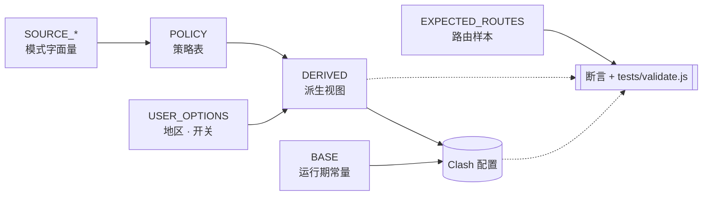

# clash-override-chain-proxy


> 你有没有遇到过这种情况：打开 ChatGPT 或 Claude，Cloudflare 验证页死活过不去，刷新一次、两次、十次，依然被拦在门外；或者某天登录时发现账号已经被封，申诉回来一句"违反使用条款"，没人告诉你到底是哪条规则、哪个 IP、哪次请求踩了线。问题的根子往往不在你这边，而在你用的机场 IP——那串地址已经被平台识别成共享代理，和你一起用它的陌生人早就把风控额度刷光了。
>
> 这份 Clash Party 覆写脚本做的事很直接：让 AI 流量（ChatGPT / Claude / Gemini / Perplexity 等）走你自己的家宽 IP 链式出口，平台每次看到的都是同一张干净的家用 IP 面孔；社交与流媒体走独立地区组，不占用家宽带宽。顺带把 DNS、Sniffer、分流规则三层接到同一套分类上，避免"规则写对了但 DNS 解析走岔、出口还是偏"的常见踩坑。

**当前版本：** v9.0

## Features

- **链式家宽出口** — AI 与开发支撑平台（ChatGPT / Claude / Gemini / Perplexity / Google / Microsoft / GitHub）按域名 + 进程名 + CLI 可执行名三层收口到 `chainRegion`。
- **媒体独立选区** — 社交与流媒体（YouTube / Netflix / X / Telegram / Discord）走 `mediaRegion` 普通地区组，不占家宽链路。
- **DIRECT 稳定保留** — 国内办公协作走境内 DoH；域外应用（Tailscale / Typeless）走 `DIRECT + 域外 DoH + skip-domain`；Tailscale CGNAT / IPv6 ULA 走 IP-CIDR。
- **DNS / Sniffer / Rules 同一套分类** — 解决"规则对但 DNS 错"的根源问题。

## Requirements

- [Clash Party](https://github.com/clash-verge-rev/clash-verge-rev) 或兼容 JavaScriptCore 覆写的 Clash 客户端
- 一份代理订阅（包含 US / JP / HK / SG 至少一个地区的节点）
- 一份家宽 IP 服务（作为链式代理前置出口）
- Node.js（仅用于跑 `tests/validate.js`，不用运行时依赖）

示例资源（可选）：代理订阅 [办公娱乐好帮手](https://xn--9kq10e0y7h.site/index.html?register=twb6RIec) · 家宽 IP [MiyaIP](https://www.miyaip.com/?invitecode=7670643)

## Usage

### Installation

1. 下载两份脚本：
   - [`src/MiyaIP 凭证.js`](src/MiyaIP%20%E5%87%AD%E8%AF%81.js)
   - [`src/家宽IP-链式代理.js`](src/%E5%AE%B6%E5%AE%BDIP-%E9%93%BE%E5%BC%8F%E4%BB%A3%E7%90%86.js)

2. 在 `MiyaIP 凭证.js` 里填入真实凭证：

   ```javascript
   function main(config) {
     config._miya = {
       username: "你的用户名",
       password: "你的密码",
       relay: { server: "12.34.56.78", port: 8022 },
       transit: { server: "transit.example.com", port: 8001 }
     };
     return config;
   }
   ```

3. 在 Clash Party 按顺序导入覆写（顺序不能反，主脚本会读 `config._miya`）：
   - `MiyaIP 凭证.js`
   - `家宽IP-链式代理.js`

   

### Configuration

主脚本顶部的 `USER_OPTIONS`：

```javascript
var USER_OPTIONS = {
  chainRegion: "SG",                            // AI 家宽出口地区
  mediaRegion: "US",                            // 媒体地区
  routeBrowserToChain: true,   // 浏览器按进程名绑定 chainRegion
  routeAiCliToChain: true      // AI CLI 按可执行名绑定 chainRegion
};
```

| 场景 | 配置 |
|---|---|
| ChatGPT 看起来在美国 | `chainRegion: "US"` |
| Claude 看起来在日本 | `chainRegion: "JP"` |
| Netflix 美区 | `mediaRegion: "US"` |
| AI 日本、媒体美国 | `chainRegion: "JP"`, `mediaRegion: "US"` |
| 关闭浏览器进程绑定 | `routeBrowserToChain: false` |
| 关闭 AI CLI 进程绑定 | `routeAiCliToChain: false` |

支持地区：`US` · `JP` · `HK` · `SG`。

### Run

启用两个覆写 → 切到机场配置 → 启动代理 → **规则模式** + **TUN 模式**已开。

脚本会自动在现有的 `代理组和节点` 组里注入两个组：

- `🇸🇬|新加坡-链式代理.跳板`（当前 `chainRegion` 对应的跳板）
- `🇺🇸|美国-媒体`（当前 `mediaRegion` 对应的媒体组）

以及新建 `🇸🇬|新加坡-链式代理.家宽IP出口` 作为家宽出口组。地区名不是硬编码的，`chainRegion` / `mediaRegion` 改变后自动同步。


### FAQ

- **报错 "缺少 `config._miya`"** — 覆写导入顺序反了。`MiyaIP 凭证.js` 必须在主脚本前，并且填了真实凭证。
- **报错 "未找到可用地区跳板 / 媒体节点"** — `chainRegion` / `mediaRegion` 在订阅中没命中任何节点。确认订阅包含该地区，并检查节点命名能否被地区正则识别（见 `BASE.regions`）。

## Testing

```bash
node tests/validate.js
```

测试用 `vm` 隔离加载脚本，覆盖默认配置、开关组合、缺失地区报错、幂等重跑、受管对象修复等 13 个用例。

## Architecture



脚本分三层数据流：**输入 → 策略与派生 → 配置与校验**。完整定义见 [`src/家宽IP-链式代理.js`](src/%E5%AE%B6%E5%AE%BDIP-%E9%93%BE%E5%BC%8F%E4%BB%A3%E7%90%86.js) 文件头部。

### 输入层

- **`USER_OPTIONS`** — 用户可调的地区选择和进程绑定开关。
- **`BASE`** — 运行期常量：地区表、节点名、组名后缀、DoH 服务器、规则前缀。
- **`SOURCE_*`** — 模式字面量，按路由意图拆成 10 个顶层常量（Apple / Chain 支撑平台 / Chain AI / Media / Direct 域内域外 / Sniffer 强制跳过 / Processes / NetworkRules）。
- **`EXPECTED_ROUTES`** — 路由样本（`toChain` / `toMedia`），声明"这些具体域名和进程应该落到哪"。运行期校验与 `tests/validate.js` 的唯一期望来源。

### 策略与派生

- **`POLICY`** — 策略表。每条 pattern 同时声明 `route` / `dnsZone` / `sniffer` / `fakeIpBypass` / `fallbackFilter`。新增类别只加一行，下游 DNS / Sniffer / 规则 / 校验视图自动同步。
- **`DERIVED`** — 从 POLICY 投影出的数据视图（`patterns` / `processNames` / `networkRules`），`build*` / `write*` 函数直接从这里读。

### 配置与校验

- **`main(config)`** — 主流程，原地改写传入的 config 对象并返回。
- **`assertExpectedRoutesCoverage`** — 加载期断言，核对 `EXPECTED_ROUTES` 没脱离 `SOURCE_*`。
- **`validateManagedRouting`** — 运行期断言，核对关键目标真落到预期出口。
- **`tests/validate.js`** — 端到端测试，`vm` 隔离加载脚本跑 13 个用例。

### 命名约定

按动词前缀分类，一眼看出副作用：

- **`build*`** — 纯函数，只返回值不改状态。
- **`resolve*`** — 读取并计算（可能触发幂等写入作为副产物）。
- **`write*`** — 写入 config。
- **`assert*`** — 运行期断言，失败即抛错。

## DNS 与 Sniffer

分流规则只是决定流量走哪个出口。**DNS 解析走错地区、TLS 握手前域名没被嗅探出来**——规则再对，出口也会跑偏。脚本让 DNS、Sniffer、规则三层共享同一套分类。

- **`nameserver-policy`（域名 → DoH 服务器）** — POLICY 里 `dnsZone: "overseas"` 的域名（Claude / ChatGPT / Gemini / Google / Microsoft / 媒体站 / Tailscale 等）绑到域外 DoH（Google / Cloudflare）；`dnsZone: "domestic"` 的（Apple / 腾讯 / 阿里 / 字节 / WPS / 国内 AI）绑到域内 DoH（AliDNS / DNSPod）。基础 `nameserver` / `fallback` 同样拆域内域外两组，`fallback-filter` 用 `geoip-code: CN` 把域内 IP 过滤掉。
- **`fake-ip-filter`（绕过 fake-ip 的白名单）** — Apple 推送、iCloud、本地域名（`+.lan` / `+.local` / `+.localhost`）、NTP、连通性探测（`msftconnecttest`）、游戏主机（Xbox / PlayStation / Nintendo）、STUN（WebRTC）、家用路由器。这些对**真实 IP 敏感**，fake-ip 会让它们失联。
- **`force-domain`（强制嗅探）** — AI 支撑平台、AI 服务本身、出口验证域都进 `sniff.force-domain`。纯 IP 或 QUIC 握手时没有明确域名线索，强制嗅探让它们仍能命中域名规则；否则会悄悄回落到 IP 规则或 `MATCH`，偏离链式出口。
- **`skip-domain`(跳过嗅探)** — Apple 推送、本地域名、Tailscale / Typeless 等域外应用。这些**故意**保留原始 IP 语义，嗅探反而破坏（Tailscale P2P 打洞、Apple 推送的 SNI 假名）。

四层配置都从 POLICY 的 `dnsZone` / `sniffer` / `fakeIpBypass` / `fallbackFilter` 字段投影——改一处，全同步。

## Compatibility

- **运行环境：** Clash Party 的 JavaScriptCore
- **语法范围：** ES5（无箭头函数、解构、模板字符串、展开语法）
- **进程分流：** 当前只维护 macOS 常见命名，其他平台需自行扩展

## License

MIT — 见 [LICENSE](LICENSE)。
